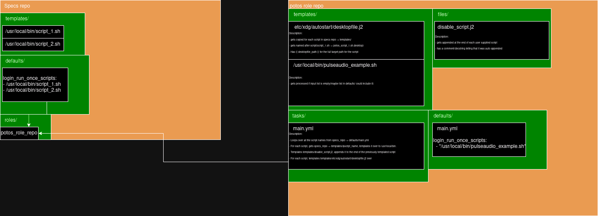

# XDG autostart role

A role for Potos, used to configure scripts that should run for users as they log in.

A key feature is to only run the script once. So the first time the user logs in, the script runs, then disables itself.

# A picture is worth a thousand words


This role is supposed to be imported into the specs repo, and configured in the specs repo's vars/ directory.

## Quickstart

If the role is only imported into the specs repo, but not configured with vars, it will deploy a script which sets the volume of the default sound sink to ~80% using pulseaudio.
To get started asap, import the role in the specs repo(files/templates/requirements.yml.j2):
```
- name: xdgautostart
  src: git+https://github.com/wickdChromosome/ansible-role-potos_xdgautostart.git
  version: 'master'
```

Now do an ansible-pull. In var/log/potos/ansible.log, you should be able to see the pulseaudio script being deployed.

In `/usr/local/bin`, you should be able to see `pulseaudio-example.sh-wrapper.sh` and `pulseaudio-example.sh`. 

In `/etc/xdg/autostart` you will find pulseaudio-example.sh-wrapper.sh.desktop.

After logout and login, if runonlyonce is set(by default it is for this example), you will find `~/.config/autotart/pulseaudio-example.sh-rapper.sh.desktop` as well, where autorun is disabled for the user you are logged in under for this script.

## Vars
Here, after importing the role in the specs repo:
```
- potos_xdgautostart: # List of scripts to autostart
    - script: "test_1.sh" # Name of script to run on user login(stored in files/potos_xdgautostart for specs repo)
      runonlyonce: yes # For each user, run the script once and only once on first login
      my_var_to_template: "1245" # If test_1.sh has $my_var_to_template, it can be templated as {{ item.my_var_to_template }} in test_1.sh
    - script: "test_2.sh" 
      runonlyonce: no # For each user, run the script on every login
```

## License

See [LICENSE](./LICENSE)

## Author Information

[Project Potos](https://github.com/projectpotos)

